# MQTT Panel Broker

This repository is part of a two-repository project that provides an easy-to-use panel for managing information 
processed by an MQTT broker. This repository, **MQTT Panel Broker**, focuses on setting up the broker functionality, 
with MQTT business logic handled via the [Mochi MQTT library](https://github.com/mochi-mqtt/server). The **MQTT
Panel** in the companion repository serves as the control panel, allowing users to view, manage, and control the flow 
of MQTT information in real time.

- This repository: **MQTT Panel Broker** - [mqtt-panel-broker](https://github.com/qreidt/mqtt-panel-broker)
- Control Panel repository: **MQTT Panel** - [mqtt-panel](https://github.com/qreidt/mqtt-panel)

## Table of Contents
- [Project Overview](#project-overview)
- [Features](#features)
- [Installation](#installation)
- [Usage](#usage)
- [Configuration](#configuration)
- [License](#license)

## Project Overview

The **MQTT Panel Broker** is written in Golang and uses the [Mochi MQTT](https://github.com/mochi-mqtt/server) library
to handle all core MQTT operations. It leverages Mochi’s hooks for data collection on each action performed by the 
broker, such as connection, subscription, publishing, and disconnection events.

An authentication layer, implemented through hooks on top of Mochi, is also integrated into this broker. This layer 
authenticates incoming client connections via an API from the **MQTT Panel** repository, ensuring that only authorized
clients can connect and interact with the broker.

Below is a sequence diagram detailing the flow of each action (connect, subscribe, publish, unsubscribe and disconnect).
In the diagram, it also is described when/how authentication and authorization are handled. 

```mermaid
sequenceDiagram
   participant Client
   participant Broker
   participant Hooks
   participant Panel


   Client->Panel: START

# Client Requested Connection
   Note over Client,Panel: Start Connection Flow
   Client->>+Broker: CONNECT
   Broker-->>Hooks: Hook: PacketProcessed
   Hooks-->>Panel: ws: MqttPacketProcessed
   Note over Broker,Hooks: Authenticate Client
   Broker->>+Hooks: Hook: CustomAuth (Connect)
   Hooks->>Panel: http: /api/mqtt/auth
   Panel->>Hooks: http: 200, 401 or 422
   Hooks->>-Broker: Authorized or Unauthorized
   Note over Broker,Hooks: Can deny connection (aka Unauthorized)
   Broker->>-Client: CONNACK
   Broker-->>Hooks: Hook: PacketProcessed
   Broker-->>Hooks: Hook: OnConnect
   Hooks-->>Panel: ws: MqttPacketProcessed
   Hooks-->>Panel: ws: MqttClientConnected
   Note over Client,Panel: End Connection Flow

# Subscribe to Topic
   Note over Client,Panel: Start Subscribe Flow
   Client->>+Broker: SUBSCRIBE
   Broker-->>Hooks: Hook: PacketProcessed
   Hooks-->>Panel: ws: MqttPacketProcessed
   Note over Broker,Hooks: Authorize Client
   Broker->>Hooks: Hook: CustomAuth (ACL)
   Hooks->>Broker: Cache Hit Auth
   Note over Broker,Hooks: Authorized if registered in cache
   Broker->>-Client: SUBACK
   Broker-->>Hooks: Hook: PacketProcessed
   Broker-->>Hooks: Hook: OnSubscribed
   Hooks-->>Panel: ws: MqttPacketProcessed
   Hooks-->>Panel: ws: MqttClientSubscribed
   Note over Client,Panel: End Subscribe Flow

# Publish QoS 0 or 1
   Note over Client,Panel: Start Publish Flow (QoS 0 or 1)
   Client->>+Broker: PUBLISH
   Broker-->>Hooks: Hook: PacketProcessed
   Hooks-->>Panel: ws: MqttPacketProcessed
   Note over Broker,Hooks: Authorize Client
   Broker->>Hooks: Hook: CustomAuth (ACL)
   Hooks->>Broker: Cache Hit Auth
   Note over Broker,Hooks: Authorized if registered in cache
   Broker->>-Client: PUBACK
   Broker-->>Hooks: Hook: PacketProcessed
   Broker-->>Hooks: Hook: OnPublished
   Hooks-->>Panel: ws: MqttPacketProcessed
   Hooks-->>Panel: ws: MqttClientPublished
   Note over Client,Panel: End Publish Flow

# Publish Qos 2
   Note over Client,Panel: Start Publish Flow (QoS 2)
   Client->>+Broker: PUBLISH
   Broker-->>Hooks: Hook: PacketProcessed
   Hooks-->>Panel: ws: MqttPacketProcessed
   Note over Broker,Hooks: Authorize Client
   Broker->>Hooks: Hook: CustomAuth (ACL)
   Hooks->>Broker: Cache Hit Auth
   Note over Broker,Hooks: Authorized if registered in cache
   Broker->>Client: PUBREC
   Broker-->>Hooks: Hook: PacketProcessed
   Hooks-->>Panel: ws: MqttPacketProcessed
   Client->>Broker: PUBREL
   Broker->>-Client: PUBCOMP
   Broker-->>Hooks: Hook: PacketProcessed
   Broker-->>Hooks: Hook: PacketProcessed
   Hooks-->>Panel: ws: MqttPacketProcessed
   Hooks-->>Panel: ws: MqttPacketProcessed
   Note over Client,Panel: End Publish Flow

# Unsubscribe from Topic
   Note over Client,Panel: Start Unsubscribe Flow
   Client->>+Broker: UNSUBSCRIBE
   Broker-->>Hooks: Hook: PacketProcessed
   Hooks-->>Panel: ws: MqttPacketProcessed
   Broker->>-Client: UNSUBACK
   Broker-->>Hooks: Hook: PacketProcessed
   Broker-->>Hooks: Hook: OnUnsubscribed
   Hooks-->>Panel: ws: MqttPacketProcessed
   Hooks-->>Panel: ws: MqttClientUnsubscribed
   Note over Client,Panel: End Unsubscribe Flow

# Pinging
   Note over Client,Panel: Start PING Flow
   Client->>+Broker: PINGREQ
   Broker->>-Client: PINGRESP
   Broker-->>Hooks: Hook: PacketProcessed
   Broker-->>Hooks: Hook: PacketProcessed
   Hooks-->>Panel: ws: MqttPacketProcessed
   Hooks-->>Panel: ws: MqttPacketProcessed
   Note over Client,Panel: End PING Flow

# Client Requested Disconnection
   Note over Client,Panel: Start Disconnect Flow
   Client->>Broker: DISCONNECT
   Broker-->>Hooks: Hook: PacketProcessed
   Broker-->>Hooks: Hook: OnDisconnect
   Hooks-->>Panel: ws: MqttPacketProcessed
   Hooks-->>Panel: ws: MqttClientDisconnected
   Note over Client,Panel: Start Disconnect Flow

   Client->Panel: END
```



## Features

- **Easy Integration with Control Panel**: Works in tandem with the **MQTT Panel** control interface to provide real-time data management and user-friendly controls.
- **Customizable Hook-Based System**: Uses Mochi's hook-based architecture to allow fine-grained data collection and action handling.
- **Authentication Layer**: Ensures secure client access by authenticating new connections through the API provided by the **MQTT Panel**.
- **Efficient MQTT Operations**: Mochi MQTT library provides efficient and robust MQTT business logic.

## Installation

To set up and run the **MQTT Panel Broker**:

1. **Clone this repository**:
   ```bash
   git clone https://github.com/qreidt/mqtt-panel-broker.git
   cd mqtt-panel-broker
   ```
   
2. **Install Dependencies:** Ensure you have Go installed. Then install any required packages:
   ```bash
   go mod tidy
   ```
3. **Build the Project:**
   ```bash
   go build -o mqtt-panel-broker
   ```
   
## Usage
Run the broker executable to start the MQTT broker:
```bash
./mqtt-panel-broker
```

## Configuration
You may configure the broker through environment variables or configuration files. Key configurations include:

- **MQTT Settings**: Configure MQTT topics, QoS levels, and other parameters as needed.
- **Authentication API URL:** Set the URL for the MQTT Panel API used to authenticate client connections.
- **Logging Options:** Enable or disable detailed logs for debugging and performance monitoring. 
For full configuration options, refer to the code comments and configuration files provided in this repository.

## License
This project is licensed under the [MIT License](https://opensource.org/license/mit).
